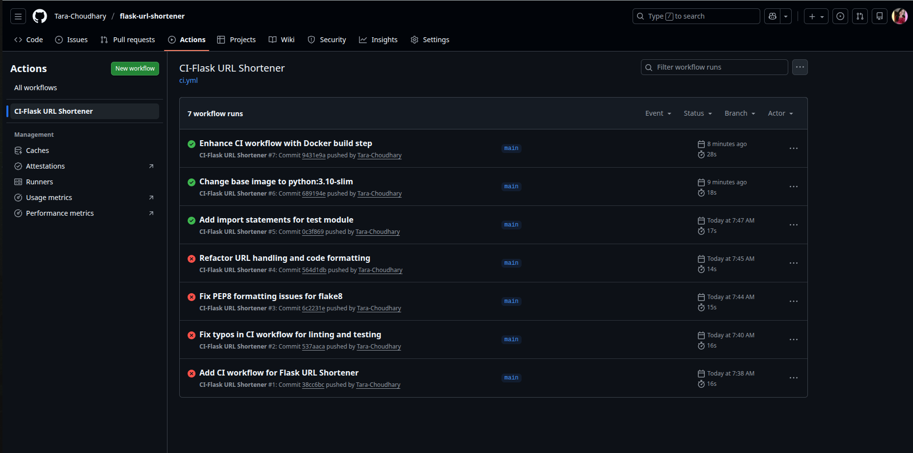

# 🚀 Flask URL Shortener (Deployed on AWS EC2)


A simple and clean **URL Shortener Web Application** built with **Python Flask**, initially deployed manually on **AWS EC2 (Free Tier)**, and later enhanced with a **Continuous Integration (CI) pipeline** using **GitHub Actions**.


### This project demonstrates:
- Python backend development  
- Flask web framework  
- AWS EC2 deployment  
- Linux server setup  
- Git & GitHub workflow
- Continuous Integration (CI) using GitHub Actions
- Automated linting and testing
- Docker image build validation


## 🛠 Application / Production Support Documentation

In addition to development and CI, this project was operated as a **production-style application**
on AWS EC2 with responsibilities similar to an **Application / Production Support Engineer**.

The following support and operations work was performed:

- Dedicated IAM user with least-privilege access
- EC2 provisioning and secure SSH access
- Application health checks and troubleshooting
- Network and port validation
- Conversion of the Flask app into a systemd-managed service
- Automatic restart and startup on reboot
- Log monitoring using journalctl
- Incident-style debugging and validation

📄 **Detailed support documentation and evidence** can be found here:

👉 [`aws-setup/Support/README.md`](aws-setup/Support/README.md)

## 📸 Live Deployment Screenshots

All AWS screenshots are stored inside the **`/aws-setup`** folder:

- EC2 Instance (Running)
- Instance Details + Public IP
- Security Group Inbound Rules
- SSH terminal logs
- Flask installation
- Web app running on browser
- Short URL generation output (success)

These screenshots serve as proof of actual AWS deployment.

## 📝 Features

- 🔗 Shorten any long URL
- 🔁 Redirect using short unique code
- 🗑️ Delete shortened URLs
- 🧠 JSON file used as a storage DB (no external DB needed)
- 🌐 Deployed on AWS EC2 instance
- 🖥️ Clean UI with HTML + CSS (Jinja2 templating)

## 🏗️ Project Structure
```
flask-url-shortener/
│
├── app.py
├── urls.json
├── requirements.txt
├── Dockerfile
│
├── tests/
│ └── test_app.py
│
├── .github/
│ └── workflows/
│   └── ci.yml
│
├── templates/
│ └── index.html
│
├── static/
│ └── style.css
│
└── aws-setup/
  └── (AWS & CI screenshots)

```

## 🏛️ Architecture Diagram (AWS)
```
    ┌───────────────────────────────────────┐
    │             User Browser               │
    │    http://<EC2 Public IP>:5000         │
    └───────────────────────────────────────┘
                    │
                    ▼
    ┌───────────────────────────────────────┐
    │             AWS EC2 Instance           │
    │   Amazon Linux 2023 (t2.micro/t3.micro)│
    │                                        │
    │   ┌─────────────────────────────────┐  │
    │   │        Flask Application        │  │
    │   │  - app.py                       │  │
    │   │  - urls.json (data storage)     │  │
    │   │  - HTML + CSS templates         │  │
    │   └─────────────────────────────────┘  │
    │                                        │
    │  Security Group:                       │
    │  - Port 22 (SSH)                       │
    │  - Port 5000 (Flask App)               │
    └───────────────────────────────────────┘

```
## 🔁 Continuous Integration (CI) Pipeline
This project uses GitHub Actions to automate quality checks and Docker build validation before deployment.

On every **push** or **pull request** to the `main` branch, the pipeline automatically:

- 🧪 Sets up a clean Ubuntu runner with **Python 3.10**
- 📦 Installs dependencies from `requirements.txt`
- 🔍 Runs **flake8** for Python code quality (PEP8 compliance)
- 🧪 Runs **pytest** to validate application functionality
- 🐳 Builds a **Docker image** to ensure the app can be containerized successfully

This ensures only **clean, tested, and buildable code** passes the pipeline.

This CI pipeline acts as a quality gate, preventing broken or non-containerizable code from reaching deployment.


> ⚠️ Note: This CI pipeline performs code quality checks, testing, and Docker build validation only. Deployment to AWS EC2 is currently done manually and is not automated via CI/CD.


## ⚙️ CI Workflow File
```
.github/workflows/ci.yml
```

### 🧪 Automated Testing

Basic automated testing is implemented using **pytest**:

```
tests/
└── test_app.py
```

The test verifies:
- Flask app loads correctly
- Home route (`/`) responds with HTTP `200 OK`

## 🐳 Docker Integration (CI Build Validation)

The application is containerized using Docker.

During CI:
- The Docker image is **built only for validation**
- No image is pushed to Docker Hub
- No deployment occurs at this stage

This validates Dockerfile correctness and container readiness.

Docker is currently used for build validation in CI and prepares the application for future container-based deployments.


### 📊 CI Pipeline Execution (GitHub Actions)

Below is a screenshot of GitHub Actions workflow runs showing:
- Initial CI failures
- Debugging and fixes
- Final successful pipeline execution

This reflects a **real-world DevOps workflow**.



## 🖥️ Run Locally (Development Setup)

### 1 Clone the repository
```
git clone https://github.com/Tara-Choudhary/flask-url-shortener.git
cd flask-url-shortener
```

### 2 Create virtual environment
```
python3 -m venv venv
source venv/bin/activate
```

### 3 Install dependencies
```
pip install -r requirements.txt
```

### 4 Run Flask app
```
python3 app.py
```
```
Visit the app locally at:
👉 http://127.0.0.1:5000
```

## ☁️ Deploy to AWS EC2

### Step 1: Launch EC2 Instance

- Amazon Linux 2023

- Instance type: t2.micro / t3.micro (Free Tier)

- Key pair: **.pem** file

- Configure Security Group:

   - SSH → **Port 22**
   - Custom TCP → **Port 5000**


### Step 2: SSH into instance

```
chmod 400 flask-key.pem
ssh -i flask-key.pem ec2-user@<YOUR_PUBLIC_IP>
```


### Step 3: Install Python, pip, Git 

```
sudo apt update -y
sudo apt install python3 python3-pip git -y
```

### Step 4: Clone repository

```
git clone https://github.com/Tara-Choudhary/flask-url-shortener.git
cd flask-url-shortener
```

### Step 5: Install Flask dependencies

```
pip3 install -r requirements.txt
```

### Step 6: Run the Flask app

```
python3 app.py
```
#### You'll see: 

```
Running on http://0.0.0.0:5000
```

### Step 7: Open app in browser

```
http://<EC2-PUBLIC-IP>:5000
```

<!-- ## Tech Stack

- Python 3
- Flask 3
- HTML, CSS, Jinja2
- AWS EC2
- Amazon Linux
- Git & GitHub -->
## 🛠️ Tech Stack


## 📬 Contact

**Author:** Tara Choudhary  

**GitHub:** [Tara-Choudhary](https://github.com/Tara-Choudhary)  

**LinkedIn:** [Tara Choudhary](https://www.linkedin.com/in/tara-choudhary00/)  

**Email:** developer.tarachoudhary@gmail.com

## License
This project is licensed under the MIT License.
